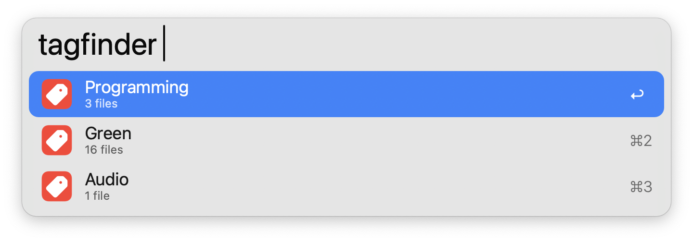

#  Tag Finder

Filter files by tag

## Setup

This workflow requires [tag](https://github.com/jdberry/tag/) to function. Can be installed via Homebrew with `brew install tag`

## Usage

Search for tags using the `tagfinder` keyword. Select a tag to view all associated files.

* <kbd>↩</kbd> Open file
* <kbd>⌘</kbd><kbd>↩</kbd> Reveal file in Finder
* <kbd>⇧</kbd><kbd>↩</kbd> Go back to Tag List
* <kbd>⇧</kbd> Tap to Quick Look file