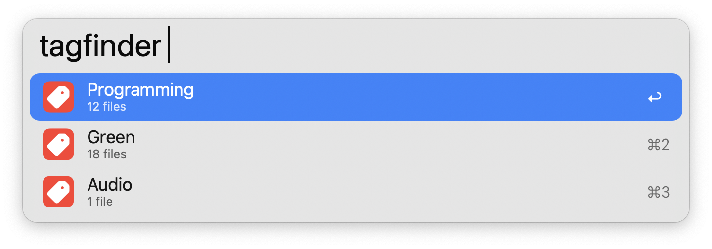
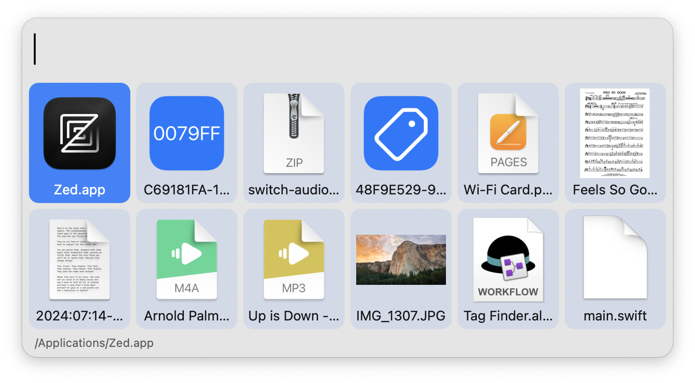

#  Tag Finder

Filter files by tag

[⤓ Install from the Alfred Gallery](https://alfred.app/workflows/firefingers21/tag-finder/)

## Setup

This workflow requires [tag](https://github.com/jdberry/tag/) to function, which can be installed [via Homebrew](https://formulae.brew.sh/formula/tag).

## Usage

Search for tags using the `tagfinder` keyword.

* <kbd>↩</kbd> Show files in Alfred
* <kbd>⌘</kbd><kbd>↩</kbd> Show files in a Finder window

Type to filter files by name. Select a file to action it.

* <kbd>↩</kbd> Open file
* <kbd>⌘</kbd><kbd>↩</kbd> Reveal file in Finder
* <kbd>⇧</kbd><kbd>↩</kbd> Return to Tag List
* <kbd>⌘</kbd><kbd>Y</kbd> (or tap <kbd>⇧</kbd>) Quick Look file

File previews are configurable in the [Workflow's Configuration](https://www.alfredapp.com/help/workflows/user-configuration/) in addition to the number of columns they take up.