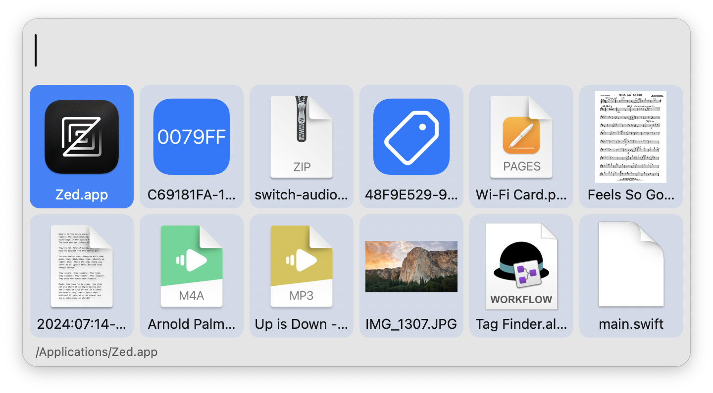

#  Tag Finder

Filter files by tag

## Setup

This workflow requires [tag](https://github.com/jdberry/tag/) to function. Can be installed via Homebrew with `brew install tag`

## Usage

Search for tags using the `tagfinder` keyword. Select a tag to view all associated files.

Type to filter files by name. Select a file to action it.

* <kbd>↩</kbd> Open file
* <kbd>⌘</kbd><kbd>↩</kbd> Reveal file in Finder
* <kbd>⇧</kbd><kbd>↩</kbd> Return to Tag List
* <kbd>⇧</kbd> Tap to Quick Look file

File previews are configurable in the [Workflow's Configuration](https://www.alfredapp.com/help/workflows/user-configuration/) in addition to the number of columns they take up.